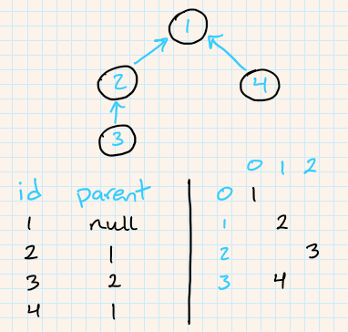

# Assignment 3 - Views 👀

- 💯 **Worth**: 8%
- 📅 **Due**: March 28, 2021 @ 23:59
- 🙅🏽‍ **Penalty**: Late submissions lose 10% per day to a maximum of 3 days. Nothing is accepted after 3 days and a grade of 0% will be given.

## 🎯 Objectives

- **Transact** data to and from a database using models.
- **Interface** between the client and models using controllers.
- **Route** to the proper controller based on the HTTP method and resource requested.

## 🔨 Setup

1. Navigate to `~/web-ii/Assignments`.
2. Click `Code -> 📋` to copy the URL to the repository.
3. Clone the Git repo `git clone <paste URL from GitHub>` (without the angle brackets).
   - You may have to use the `HTTPS` or `SSH` URL to clone depending on your settings. If one doesn't work, try the other by clicking `Use SSH` or `Use HTTPS` above the 📋, and copy the new URL.
4. You should now have a folder inside `Assignments` called `assignment-3-githubusername`.
   - If you want, you can rename this folder to `3-Views` for consistency's sake! 😉
5. Inside of the newly cloned repo, copy the following from A2 into A3:
   - `src/controllers`
   - `src/models`
   - `src/router/Request.js`
   - `src/router/Router.js`
6. Copy the following from E3.3 into A3:
   - `src/router/JsonResponse.js`
   - `src/router/HtmlResponse.js`
   - `src/router/Response.js`

## 🔍 Context

> **🚨 Warning:** If you have not finished **E3.1, E3.2, and E3.3**, **turn back now and finish them** before attempting this assignment or you will be **terribly lost**. The exercises are designed to give you all the tools, knowledge, and strategies needed to complete the assignments.

In A1, we created the 4 main models (`User`, `Category`, `Post`, and `Comment`) that are in charge of talking to the database. The models are based on the entities from the ERD which can be found in the A1 specs.

In A2, we implemented the `Router` that handles the web requests/responses and instantiates a `Controller`. We also implemented the `Controller` which takes care of deciding which model method to call.

In this assignment, we will implement the following:

1. The **error-handling** of our application by **throwing and catching exceptions**. If the `Model` throws an `Error` (or a class derived from `Error`), it will be caught by the `Controller` and thrown up to the `Router`. The `Router` will populate the `Response` message using the error from the `Error`.
2. The **views** of our application using the [Handlebars templating engine](https://handlebarsjs.com). We've taken care of a large portion of the back-end; now it's time to build an interface the user can interact with!

## 🗺️ Routes

| HTTP Method | Path                  | Action                            | Redirect/Template   | Description                               |
| ----------- | --------------------- | --------------------------------- | ------------------- | ----------------------------------------- |
| `GET`       | `/`                   | `HomeController::home`            | `HomeView`          | Display the homepage (all categories).    |
| `ANY`       | `/{garbage}`          | `ErrorController::error`          | `ErrorView`         | Display a 404 error page.                 |
| `GET`       | `/user/new`           | `UserController::getNewForm`      | `User/NewFormView`  | Display a form to create a new user.      |
| `POST`      | `/user`               | `UserController::new`             | `/user/{id}`        | Register a user.                          |
| `GET`       | `/user/{id}`          | `UserController::show`            | `User/ShowView`     | Display a user's profile.                 |
| `PUT`       | `/user/{id}`          | `UserController::edit`            | `/user/{id}`        | Edit a user's profile.                    |
| `DELETE`    | `/user/{id}`          | `UserController::destroy`         | `/user/{id}`        | Deactivate a user's profile.              |
| `POST`      | `/category`           | `CategoryController::new`         | `/`                 | Create a new category.                    |
| `GET`       | `/category/{id}`      | `CategoryController::show`        | `Category/ShowView` | Display all posts in a category.          |
| `GET`       | `/category/{id}/edit` | `CategoryController::getEditForm` | `Category/EditView` | Display a form to edit a category.        |
| `PUT`       | `/category/{id}`      | `CategoryController::edit`        | `/category/{id}`    | Edit category title/description.          |
| `DELETE`    | `/category/{id}`      | `CategoryController::destroy`     | `/`                 | Deactivate a category.                    |
| `POST`      | `/post`               | `PostController::new`             | `/category/{id}`    | Create new post.                          |
| `GET`       | `/post/{id}`          | `PostController::show`            | `Post/ShowView`     | Display a post's details and comments.    |
| `GET`       | `/post/{id}/edit`     | `PostController::getEditForm`     | `Post/EditView`     | Display a form to edit a post.            |
| `PUT`       | `/post/{id}`          | `PostController::edit`            | `/post/{id}`        | Edit contents of text post.               |
| `DELETE`    | `/post/{id}`          | `PostController::destroy`         | `/post/{id}`        | Deactivate a post.                        |
| `POST`      | `/comment`            | `CommentController::new`          | `/post/{id}`        | Create a new comment.                     |
| `GET`       | `/comment/{id}`       | `CommentController::show`         | `Comment/ShowView`  | Display a comment along with its replies. |
| `GET`       | `/comment/{id}/edit`  | `CommentController::getEditForm`  | `Comment/EditView`  | Display a form to edit a comment.         |
| `PUT`       | `/comment/{id}`       | `CommentController::edit`         | `/post/{id}`        | Edit the contents of a comment.           |
| `DELETE`    | `/comment/{id}`       | `CommentController::destroy`      | `/post/{id}`        | Deactivate a comment.                     |

## 🧪 Tests

Inside of the `tests` folder you will find five subfolders of test suites.

1. `tests/models` will call methods directly on the models to see if the correct data is being transacted to/from the database.
2. `tests/controllers` will invoke methods on the controllers to see if the right models are being called based on the request.
3. `tests/router` tests will verify that your router is calling the proper controllers and based on the request.
4. `tests/http` will simulate a web client using the [Node HTTP module](https://nodejs.org/docs/latest-v14.x/api/http.html). It will make requests for JSON data and test if your router is:
   1. Parsing the request data correctly
   2. Calling the correct controller
   3. Sending the correct response back to the client
5. `tests/browser` will make use of the [Playwright](https://playwright.dev) UI testing library. It will spin up a web browser, make requests for HTML data, navigate to web pages, click on elements, fill out forms, etc. In order to debug these tests, you can use `npm run testDebug`. When you run this command, you will see a little debug window appear beside the browser window.

For the first four suites, you will have to implement exception handling like you learned how to do in E3.1. From there, the bulk of the work will be the browser tests. As usual, always work on the tests in this order: `User > Category > Post > Comment`.

### 🎥 [Test Suite Video](https://youtu.be/GQnlT0we210)

The test code itself serves as a guide for you to create your views as they will tell you what elements on the page it expects. To aid you further, I've recorded a run of all the tests which can be found [here](https://youtu.be/GQnlT0we210). This will enable you to see my interpretation of the pages and how they look and function. Use YouTube's [playback speed](https://www.howtogeek.com/702364/how-to-speed-up-youtubes-playback-speed-or-slow-it-down/) feature to slow down the video.

### 🐞 Debugging

Please refer to the debugging section of E3.3 for a detailed explanation on how to debug browser tests.

## 💬 Comments and Replies (Threading)

Threading is going to be the most challenging piece to implement which is why `browser/comment.test.js` is worth more than the other three browser test suites. To try and help you with this, let's take a look at the diagram below:



We have 4 comments with IDs `1`, `2`, `3`, and `4`. `1` has a parent of `null` which means it's a "top level comment". In other words, it's not a reply to anything. `2` and `4` are replies to `1`. `3` is a reply to `2`.

The way we want this displayed to the user is what the bottom right portion of the diagram is outlining. `1` should be in the top right corner. `2` comes below it, and indented "one level". `3` comes after `2`, indented another level. `4` is below everything preceding it, but only indented one level, since it's a reply to `1`. The key to this whole thing is calculating the levels of each comment. That's the hard part, but it's why this particular test (`Comment and replies found.`) is worth `20%` of the whole grade.

Chris Chadillon, a fellow JAC CS teacher, made a couple of videos a few years ago explaining how comment threading works in a forum application. He goes through the pseodocode and the algorithms that you can use to implement this feature. Please note that his specific example will be different than ours and things may not line up one-to-one. The general concept is the same and it's your job to take the algorithm and apply it to our Reddit clone app.

- [Threading - Part One](https://www.youtube.com/watch?v=o9UJbig1HoY)
- [Threading - Part Two](https://www.youtube.com/watch?v=3SU0Ed6CkhE)

## 🤹‍♀️ Other Stuff

- You'll have to write some additional model methods:
  - `User.findByUsername()`
  - `Category.findByTitle()`
  - `Post.findByCategory()`
  - `Comment.findByPost()`
- A deleted category means that you cannot update that category or add posts to it.
- A deleted post means you cannot update that post, add comments to it, or reply to any comments.
- A deleted comment means the content is not displayed and you cannot reply to it.
- Since the homepage is effectively useless, we'll use it to display all the categories and the form to make a new category.
- For all the forms where we create a new category/post/comment, we have to manually supply the user ID because we haven't implemented a login system yet. I know it seems very strange, but don't worry because we'll be getting rid of any reference to user ID in the next assignment when we implement user authentication.
- Use `<input type="hidden">` to store/send any data you don't want displayed to the user.
- To give you creative freedom I've tried to make the css selectors in the tests as loose as possible.
  - `.comment[comment-id="commentId"]` could mean a row in a table, a list item, a div, etc. as long as it has a class of `comment` and an attribute of `comment-id` that has the value of the comment it is displaying. Ex:

    ```html
    <tr class="comment" comment-id="1"></tr>
    <!-- or -->
    <li class="comment" comment-id="1"></li>
    <!-- or -->
    <div class="comment" comment-id="1"></div>
    <!-- etc. -->
    ```

## 📥 Submission

Check that all tests are passing by removing all occurrences of `.only` and running the test suite for the final time. Once you've made your final `git push` to GitHub, here's what you have to do to submit:

1. Go to [Gradescope](https://www.gradescope.ca/courses/828) and click the link for this assignment.
2. Select the correct repository and branch from the dropdown menus.
3. Click _Upload_.
4. Wait for the autograder to finish grading your submission. Once it's done, you should see the final output of the test results as well as your grade on the top right.

### 💯 Grade Distribution

- `browser/user.test.js` = **20%**
- `browser/category.test.js` = **20%**
- `browser/post.test.js` = **20%**
- `browser/comment.test.js`:
  - `Comment and replies found.` = **20%**
  - All other comment tests = **20%**
- Breaking any of the `model`, `controller`, `router`, or `http` tests = **-0.5%** for every broken test.
