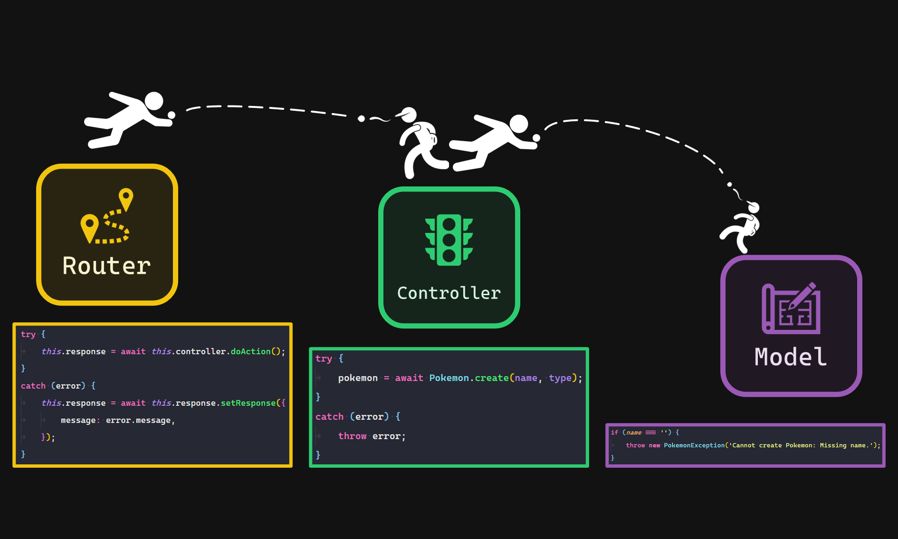
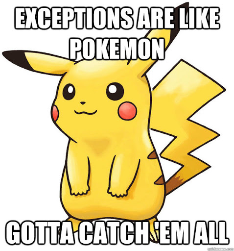

# Exercise 3.1 - Exceptions ⚠️

- 💯 **Worth**: 1%
- 📅 **Due**: March 14, 2021 @ 23:59
- 🙅🏽‍ **Penalty**: Late submissions lose 10% per day to a maximum of 3 days. Nothing is accepted after 3 days and a grade of 0% will be given.

## 🎯 Objectives

- `Throw` exceptions when things in the application go wrong.
- `Catch` exceptions that have been thrown.
- `Log` exceptions to a text file.
- `Present` friendly messages to the user when exceptions occur.

## 🔨 Setup

1. Navigate to `~/web-ii/Exercises`.
2. Clone the Git repo `git clone <paste URL from GitHub>` (without the angle brackets).
3. You should now have a folder inside `Exercises` called `exercise-3_1-githubusername`.
   - If you want, you can rename this folder `3.1-Error-Handling` for consistency's sake! 😉
4. Copy over the `controllers`, `models`, and `router` folders from **E2.3**:

   ```text
   3.1-Error-Handling
   ├── src
   │   ├── App.js
   │   ├── controllers <------- Copy over from E2.3
   │   │   ├── Controller.js
   │   │   ├── ErrorController.js
   │   │   ├── HomeController.js
   │   │   └── PokemonController.js
   │   ├── database
   │   │   ├── .env
   │   │   └── Database.js
   │   ├── exceptions
   │   │   ├── DatabaseException.js
   │   │   ├── Exception.js
   │   │   └── PokemonException.js
   │   ├── helpers
   │   │   ├── HttpStatusCode.js
   │   │   └── Logger.js
   │   ├── logs
   │   │   └── 2021-3-8.log
   │   ├── models <------------ Copy over from E2.3
   │   │   ├── Model.js
   │   │   └── Pokemon.js
   │   └── router <------------ Copy over from E2.3
   │       ├── Request.js
   │       ├── Response.js
   │       └── Router.js
   └── tests
       ├── controller.test.js
       ├── http.test.js
       ├── model.test.js
       └── router.test.js
   ```

5. Run `code ~/.bashrc` to open the `.bashrc` file in VSC.
6. Add `export NODE_ENV="development"` to the end of the file.
7. Save `.bashrc` and close it.
8. Close and reopen all open terminals.
9. Verify the new environment variable exists by running `echo $NODE_ENV`. The output should be `development`.

## 🔍 Context

The users of our applications are **dumb**; they will find ways to interact with our application that make no sense! Another way of saying this: they will interact with our application in _exceptional_ ways. It is part of our job as software developers to make sure that our apps won't break at the hands of users who do dumb things. 🥴

The mechanism we use to handle these _exceptional_ situations is, you guessed it, **exceptions**! Exceptions are a core part of any robust application.

An **exception is simply an object** that we can pass around our program using a special syntax. This special syntax is `try/throw/catch`. When an `Error` object is instantiated inside of a function using the `throw` keyword, that function immediately stops executing, and returns the `Error` object.

```js
const addTwoPositiveNumbers = (a, b) => {
    if (a < 0 || b < 0) {
        throw new Error('Numbers must be positive!');
    }

    return a + b;
};

const sum = addTwoPositiveNumbers(-1, 2);

console.log(sum);
```

The output of the above code will be:

```text
/home/vik/web-ii/index.js:5
                throw new Error('Numbers must be positive!');
                ^

Error: Numbers must be positive!
    at addTwoPositiveNumbers (/home/vik/web-ii/index.js:5:9)
    at Object.<anonymous> (/home/vik/web-ii/index.js:11:13)
    at Module._compile (internal/modules/cjs/loader.js:1063:30)
    at Object.Module._extensions..js (internal/modules/cjs/loader.js:1092:10)
    at Module.load (internal/modules/cjs/loader.js:928:32)
    at Function.Module._load (internal/modules/cjs/loader.js:769:14)
    at Function.executeUserEntryPoint [as runMain] (internal/modules/run_main.js:72:12)
    at internal/main/run_main_module.js:17:47
```

As you can see, we're getting much more information about the _context_ of where/when the program broke than if we had simply printed the error message out. The issue is that while this information is helpful to us as developers, it's scary 👻 to an end user if they had all this information presented to them! We need a way to store this information for us, the developer, while presenting a friendly message to the user. This is why **any call to a function that might throw an exception must be wrapped in a `try/catch`**:

```js
const addTwoPositiveNumbers = (a, b) => {
    if (a < 0 || b < 0) {
        throw new Error('Numbers must be positive!');
    }

    return a + b;
};

try {
    let sum = addTwoPositiveNumbers(-1, 2);
    console.log(sum);
}
catch (error) {
    console.log(error.message);
}
```

The output of the above code will be:

```text
Numbers must be positive!
```

This is a much more user-friendly 😄 message! That's great for the user, but we lost all the great context about where/when the program broke. This is why we have to log any exceptions that are thrown in the application to a log file. Using a log file enables us to view errors after they've occurred - it's like looking back in time!

> 🪓 I've included a `Logger` class which you can find in `src/helpers/Logger.js`. Please open that file now and read through the comments to understand how it works. Once you're comfortable with it, please continue reading.

Let's use the `Logger` in the `catch` block:

```js
catch (error) {
    console.log(error.message);
    logger.error(error);
}
```

Assuming that the `NODE_ENV` environment variable is set to `production`, we've successfully recorded the exception information in the logs, while also presenting a friendly message to the user. We can now go back into the logs to see what went wrong, if we need to.

We can extend the built-in `Error` class just like we would any other class:

```js
class MyCustomException extends Error {}

throw new MyCustomException();
```

This way, we can handle errors using our own custom handling logic.

> 💥 I've included `Exception`, `DatabaseException`, and `PokemonException` classes which you can find in `src/exceptions`. Please open those files now and read through the comments to understand how they work. Once you're comfortable with them, please continue reading.

In summary, exceptions help us:

- avoid showing the user the "complex" error message that PHP spits out when an error occurs;
- as developers while building the application;
- debug after our application has gone into production;
- log error messages.

Here's an overview of how exceptions will be used for this exercise. Let's assume the user made a `POST /pokemon` request, but did not provide a value for `name`:



1. The `Model` will `throw` a `PokemonException` when it detects that `name` is blank.
2. The `Controller` will `catch` the `PokemonException`, and `throw` it back to the `Router`.
3. The `Router` will `catch` the `PokemonException` and use it to set the response message.

### 🧪 Tests

There are four test suites for this exercise. Assuming you got all the tests passing for E2.3, then all of the happy path tests should still pass now. The new tests are ones that check to see if the unhappy paths are handles appropriately. **Please complete the tests in this order:**

1. `model.test.js`: All of the "success" tests should pass from before. New tests have been added to test if the proper exceptions are being thrown.
2. `controller.test.js`: All of the "success" tests should pass from before. This test creates a `Request` and feeds it into the `Controller`. The tests will check if the controller throws the right exception after getting the data from the `Model`.
3. `router.test.js`: Creates a `Request` and feeds it into the `Router`. The tests will check if the `Router` sets the right `message` for the `Response` after catching the any exceptions.
4. `http.test.js`: This is the one that actually sends a real web requests to your application. It tests if your app does everything it should from beginning to end; from client to database and back again.

The way that the tests check to see if an exception was thrown is by capturing the `reject` value of the returned promise. For example, if the following exception is thrown in `Pokemon.create()`:

```js
throw new PokemonException('Cannot create Pokemon: Missing name.');
```

then the following test will pass:

```js
await expect(Pokemon.create('', type)).rejects.toMatchObject({
    name: 'PokemonException',
    message: 'Cannot create Pokemon: Missing name.',
});
```

If you're thinking, _"but wait, none of my functions return a promise, so how will this work?"_, then good job! You're paying attention. As it turns out, all `async` functions implicitly return a promise if you didn't explicitly define one. You can read more about it [here](https://developer.mozilla.org/en-US/docs/Web/JavaScript/Reference/Statements/async_function#description)!

## 🚦 Let's Go

### 💾 Database Exceptions

Recall that **any call to a function that might throw an exception must be wrapped in a `try/catch`.** The _mysql2_ package we're using to talk to the database throws it's own exceptions! Is our model catching any exceptions thrown from the database? It is, but the only thing it's doing with them is logging the message to the console and returning null:

```js
const sql = 'INSERT INTO `pokemon` (`name`, `type`) VALUES (?, ?)';
let results;

try {
    [results] = await connection.execute(sql, [name, type]);
}
catch (exception) {
    console.log(exception);
    return null;
}
finally {
    await connection.end();
}
```

After the model executes an SQL operation on the database, it should expect back:

1. An object with the `results` from the database operation; or
2. A `DatabaseException` in case something went wrong inside the database.

Let's change the `catch` block to `throw` a `DatabaseException` now:

```js
const connection = await Model.connect();
const sql = 'INSERT INTO `pokemon` (`name`, `type`) VALUES (?, ?)';
let results;

try {
    [results] = await connection.execute(sql, [name, type]);
}
catch (exception) {
    throw new DatabaseException(exception);
}
finally {
    await connection.end();
}
```

Now, if anything bad happens inside of the `Database`, then we can `catch` that exception, and `throw` it back to whoever called `create`. Do this for all model methods.

### 🗿 Model Exceptions

Inside of all the `Pokemon` model methods, notice that we're returning `null`/`false`/`[]` for the _unhappy paths_.

| Model Method | 😄 Happy Path | 😟 Old Unhappy Path | 😟 New Unhappy Path                                   |
| ------------ | ------------ | ------------------ | ---------------------------------------------------- |
| `create`     | `Pokemon`    | `null`             | `PokemonException` or `DatabaseException`            |
| `findAll`    | `[Pokemon]`  | `[]`               | `[]` or `DatabaseException`                          |
| `findById`   | `Pokemon`    | `null`             | `null` or `DatabaseException`                        |
| `save`       | `true`       | `false`            | `false` or `PokemonException` or `DatabaseException` |
| `remove`     | `true`       | `false`            | `false` or `DatabaseException`                       |

> 🎭 The _happy path_ is the path the function will take when it is successful. When a request comes in for `GET /pokemon/1`, the happy path would return a Pokemon object that has an ID of 1. The *unhappy path* would return `null` if there is no Pokemon with an ID of 1 in the database.

The _unhappy paths_ are the cases where we need to consider throwing exceptions. The tests will guide you in how to handle the unhappy paths. For example, when the `name` is blank when calling `Pokemon.create()`, a `PokemonException` should be thrown.

### 🚥 Controller Exceptions

After the controller calls a model method, it will expect back:

1. A `Pokemon` object (or array of objects); or
2. A Boolean; or
3. A `PokemonException`/`DatabaseException` in case something went wrong inside the model.

| Controller Method | 😄 Happy Path | 😟 Unhappy Path                            |
| ----------------- | ------------ | ----------------------------------------- |
| `list`            | `Response`   | `PokemonException` or `DatabaseException` |
| `show`            | `Response`   | `PokemonException` or `DatabaseException` |
| `new`             | `Response`   | `PokemonException` or `DatabaseException` |
| `edit`            | `Response`   | `PokemonException` or `DatabaseException` |
| `destroy`         | `Response`   | `PokemonException` or `DatabaseException` |

Here's an example:

```js
async new() {
    const { name, type } = this.request.getParameters().body;

    let pokemon;

    try {
        pokemon = await Pokemon.create(name, type);
    }
    catch (error) {
        throw error;
    }

    return this.response.setResponse({
        message: 'Pokemon created successfully!',
        payload: pokemon,
    });
}
```

The controller will `catch` any exceptions thrown by the model, and throw them up to whoever called the controller. We know now that the router is the class that calls the controller, so the exception will be thrown up to the router. Now you must do two things:

1. Wrap any function calls in the `PokemonController` that may potentially throw an exception in a `try`/`catch` block.
2. Throw a `PokemonException` when handling an unhappy path. The tests will guide you in how to handle the unhappy paths for the controller. For example, when the model returns `null` when calling `PokemonController.show()`, a `PokemonException` should be thrown.

### 🗺️ Router Exceptions

The only function that the `Router` calls that could potentially throw an exception is `doAction`. If `doAction` throws an exception and `dispatch` catches it, we don't want to throw it anymore. We want to extract the `message` from the exception (`exception.message`) and use that as the `message` for our `Response`, along with an empty `payload`, and a `405` (bad request) status code.

| Router Method | 😄 Happy Path  | 😟 Unhappy Path |
| ------------- | ------------- | -------------- |
| `dispatch`    | `Response(😄)` | `Response(😟)`  |

## 🌈 Conclusion

Once you've got all the tests passing, **remove all of the `try`/`catch` blocks from the controller**. All of the tests should **still pass**. This is because exceptions have a special behaviour where they _bubble up_ to the nearest function in the stack trace that contains a `try`. For example:

```js
const a = () => {
    try { b(); }
    catch (exception) { console.log(exception.message); }
};
const b = () => c();
const c = () => { throw new Error('Whoops!'); };

a();

// Output: Whoops!
```

We know that **if a function can throw an exception, then any call to that function needs to be wrapped in a `try`/`catch`**. By this rule, the call to `c` in `b` should theoretically be wrapped in a `try`/`catch`, but it's not! How does this still work? The answer is that the exception thrown in `c` **bubbles up** to `b`, `b` being the function that called `c`. When the exception notices that `b` did not call `c` using a `try`, it will **bubble up** to `a`, `a` being the function that called `b`. When the exception gets to `a` and notices that `a` is calling `b` using a `try`, the exception goes into the corresponding `catch`.

You can think of `a` as your router, `b` as your controller, and `c` as your model. This is the magic of the application's architecture: **All thrown exceptions will eventually be caught by the router since the router is essentially the start and end point of the application**. 🦸‍♀️

## 📥 Submission

Check that all tests are passing by removing all occurrences of `.only` and running the test suite for the final time. Once you've made your final `git push` to GitHub, here's what you have to do to submit:

1. Go to [Gradescope](https://www.gradescope.ca/courses/828) and click the link for this exercise.
2. Select the correct repository and branch from the dropdown menus.
3. Click _Upload_.
4. Wait for the autograder to finish grading your submission. Once it's done, you should see the final output of the test results as well as your grade on the top right.


