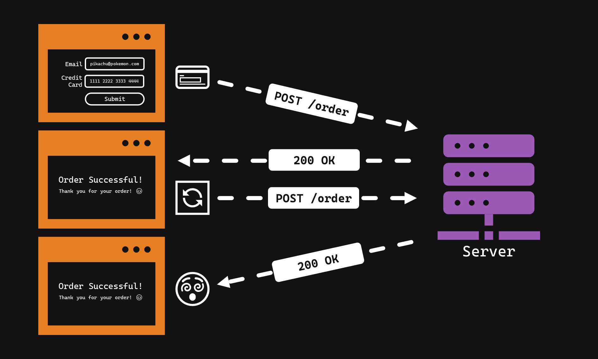
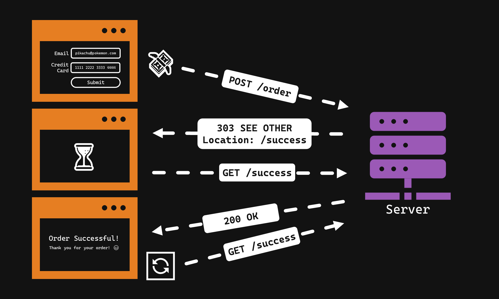
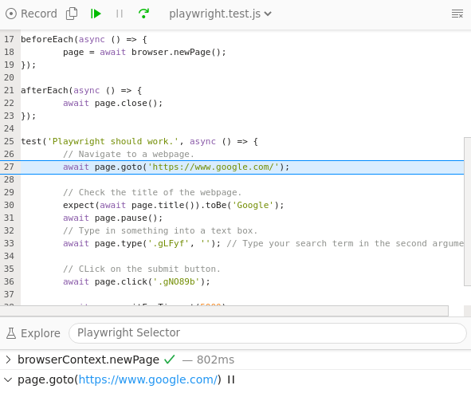

# Exercise 3.3 - Views 👀

- 💯 **Worth**: 1%
- 📅 **Due**: March _XX_, 2021 @ 23:59
- 🙅🏽‍ **Penalty**: Late submissions lose 10% per day to a maximum of 3 days. Nothing is accepted after 3 days and a grade of 0% will be given.

## 🎯 Objectives

- **Separate** presentation code from logic code using a templating engine.
- **Control** the data that is displayed using conditionals and loops inside the template files.
- **Nest** templates within one another to reuse presentation code.
- **Run** automated browser tests to ensure the application is working.

## 🔨 Setup

1. Navigate to `~/web-ii/Exercises`.
2. Clone the Git repo `git clone <paste URL from GitHub>` (without the angle brackets).
3. You should now have a folder inside `Exercises` called `exercise-3_3-githubusername`.
   - If you want, you can rename this folder `3.3-Views` for consistency's sake! 😉
4. Copy over `controllers`, `models`, `router/Request.js`, and `router/Router.js` from **E3.1**:

   ```text
   3.3-Views
   ├── App.js
   ├── controllers <---------- Copy over from E3.1
   │   ├── Controller.js
   │   ├── ErrorController.js
   │   ├── HomeController.js
   │   └── PokemonController.js
   ├── database
   │   └── Database.js
   ├── exceptions
   │   ├── DatabaseException.js
   │   ├── Exception.js
   │   └── PokemonException.js
   ├── helpers
   │   ├── HttpStatusCode.js
   │   ├── Logger.js
   │   └── Url.js
   ├── logs
   ├── models <--------------- Copy over from E3.1
   │   ├── Model.js
   │   └── Pokemon.js
   ├── router
   │   ├── HtmlResponse.js
   │   ├── JsonResponse.js
   │   ├── Request.js <------- Copy over from E3.1
   │   ├── Response.js
   │   └── Router.js <-------- Copy over from E3.1
   └── views
       └── View.js
   ```

5. 🏠 Windows users: Download and install [VcXsrv](https://sourceforge.net/projects/vcxsrv/files/latest/download). This application will be used to view the automated browser tests.
   > 🚨 **IMPORTANT**: The first time you open VcXsrv, make sure you **allow both public and private networks**.
   1. To open VcXsrv, do a Windows search for _XLaunch_.
   2. Once XLaunch opens:

      1. Choose _One large window_
      2. Choose _Start no client_
      3. Check the box for _Disable access control_
      4. Hit _Finish_ and you should see a black window appear

   3. Run `code ~/.bashrc` to open the `.bashrc` file in VSC.
   4. Add the following to the end of the file:

      ```bash
      # set DISPLAY variable to the IP automatically assigned to WSL2
      export DISPLAY=$(cat /etc/resolv.conf | grep nameserver | awk '{print $2; exit;}'):0.0

      # Automatically start dbus
      sudo /etc/init.d/dbus start &> /dev/null
      ```

   5. Save `.bashrc` and close it.
   6. Run `sudo apt update -y`.
   7. Run `sudo apt upgrade -y`.
   8. Run `sudo apt-get update -y`.
   9. Run `sudo apt-get upgrade -y`.
   10. Run:

       ```bash
       sudo apt-get install libnss3\
                 libnspr4\
                 libatk1.0-0\
                 libatk-bridge2.0-0\
                 libcups2\
                 libdrm2\
                 libxkbcommon0\
                 libxcomposite1\
                 libxdamage1\
                 libxfixes3\
                 libxrandr2\
                 libgbm1\
                 libgtk-3-0\
                 libpango-1.0-0\
                 libcairo2\
                 libatspi2.0-0\
                 libglu1-mesa -y
       ```

   11. Close and reopen all open terminals.
6. Navigate to the exercise folder and run `npm install`.
7. Open `tests/playwright.test.js` and type something that you want Google to search for on line 33 in the `page.type()` function call.
8. Run `npm run test -- playwright.test.js` and watch your XLaunch window. You should see it start a Chromium browser and do a Google search based on what you wrote in the test! How cool is that?! 😎
   - If you're a non-Windows user, a regular browser window will open instead.
9. Once that is working, you can delete `playwright.test.js`.

## 🔍 Context

In the last exercise we got familiar with the [Handlebars templating engine](https://handlebarsjs.com) and learned how we can use it to separate the **presentation code** from the **logic code**. In this exercise, we'll be applying the same principles to the Pokemon app. The starter code for this exercise has several key components that you should familiarize yourself with before getting started:

### ⚔️ JSON vs. HTML

We can now send back 2 types of data: JSON or HTML. The type of data sent back in the response will be dictated by the type of data the request asks for in the [`Accept` header](https://developer.mozilla.org/en-US/docs/Web/HTTP/Headers/Accept) (`App.js` line 55).

The `Response` class is now `abstract` and two new concrete classes have been created: `HtmlResponse` and `JsonResponse`. Both of these concrete classes must implement the abstract method that is defined inside of `Response`, which is `setResponse()`.

All of the `PokemonController` methods will need to call `setResponse` and pass in data that is relevant to both types of responses. For example:

   ```js
   this.response.setResponse({
       template: "Pokemon/ListView",
       title: "All Pokemon",
       message: "Pokemon were retrieved successfully!",
       payload: pokemon
   });
   ```

- `template` and `title` will only be used by an `HtmlResponse`, and ignored by a `JsonResponse`. To get a better idea of what is happening, please look at the `setResponse` method of both types of responses.
- `payload` will be used by both types of responses.

> 💡 The beauty of this design is we're using [polymorphism](https://en.wikipedia.org/wiki/Polymorphism_(computer_science)) to call `setResponse`. The controller does not need to know if `this.response` is an instance of `HtmlResponse` or `JsonResponse`. By using polymorphism, we define `setResponse` on both response classes so that the controller does not have to perform different logic based on what type of response the client is expecting.

### 👀 View Class

There is a new `src/views/View.js` wrapper class for the Handlebars library that we can use to manage our views. The functions inside this class should be ones that you are familiar with when you worked with Handlebars in E3.2. This class is used when calling the `setResponse` method of `HtmlResponse`. As you saw from the code snippet in the previous section, a `template` name is passed into `setResponse`, along with other data like `title` and `payload` which Handlebars will need when compiling our views. The `View` class takes these pieces of data and gives them to Handlebars so that when we call `response.toString()` (`App.js` line 47), we get the rendered view.

The name of the `template` corresponds to the file path to the `.hbs` file starting from the `src/views` directory. As you saw from the code snippet in the previous section, the `template` is being set to `Pokemon/ListView`. This will then get mapped to `src/views/Pokemon/ListView.hbs`.

The `View` class also takes care of loading all the [partials](https://handlebarsjs.com/guide/partials.html#partials) for us. If we want to nest a template inside of another, we just need to reference it the same way we do when calling `setResponse`. For example, if we wanted to nest the list of Pokemon in our home view, we could do this:

```Handlebars
<!-- Home.hbs -->
<h1>{{ header }}</h1>

{{> Pokemon/ListView }}
```

### 🔗 URL Class

There is also a new `src/helpers/Url.js` class. This class will provide the base URL (i.e. `localhost`) for us as well as construct any URLs we need throughout the app. The reason we want to use a class like this is because without it, we would have to hardcode `http://localhost:8000` everywhere in our views. Now we only have to keep track of our URL in one place, and if we ever buy a domain name in the future, it will be very easy to update all the URLs referenced in our app!

You will see this class used often in the tests, so it should be self-explanatory. Using this class in the view files is a little strange. Since we cannot write JS in the view files, here is how we can use this class in a view file:

```Handlebars
<a href="{{ base }}">Home</a>
<a href="{{ path 'pokemon/new' }}">Create Pokemon</a>
<a href="{{ path 'pokemon/{id}' payload.id }}">Pikachu</a>
```

After calling `response.toString()`, this will get rendered to:

```html
<a href="http://localhost:8000">Home</a>
<a href="http://localhost:8000/pokemon/new">Create Pokemon</a>
<a href="http://localhost:8000/pokemon/1">Pikachu</a>
```

If you're curious as to how this works, please take a look at the constructor of the `View` class where I register several Handlebars helper functions.

### ↩️ HTTP Redirect

Ever wonder how the _refresh_ button in your web browser actually works? How does it actually "refresh" a page? It's quite simple - the refresh button re-sends whatever the last HTTP request was.

Let's look at the diagram below. Suppose you make a `POST /order` request and get a `200 OK` response back. If you click the refresh button now, the browser will make the last request that was sent out - meaning that you will have created another order! No one likes paying twice...



Let's look at the diagram below to learn how we can mitigate this problem using redirects. Suppose you make a `POST /order` request, but instead of getting a `200 OK` response back, you get a `303 SEE OTHER` response. The `3xx` range of HTTP response codes all have to do with redirects and you can read up about them [here](https://developer.mozilla.org/en-US/docs/Web/HTTP/Status#redirection_messages). As soon as the browser sees that the response is a `303`, it will immediately make a `GET` request to the location specified in the responses `Location` header. The server will receive the `GET /success` request and send back a `200 OK`. If you click the refresh button now, the browser will make the last request that was sent out - meaning that you will receive the success page again but the actual order will only have been made once! Phew, that was close...



We will be utilizing redirects to protect the user from making accidental repeat `POST`, `PUT`, and `DELETE` requests to the server. If you look in the `src/router/Response.js` class, you'll see the mechanism for adding headers to the response. Namely, the `redirect()` method adds the `Location` header to the list of headers maintained by the `Response` class as well as sets the status code to `303 SEE OTHER`. The headers get written to the actual HTTP response in `App.js` on line 46. The `HtmlResponse` class is where `redirect` gets called if there was a redirect parameter sent in when `setResponse` was called from the controller. For example:

```js
return this.response.setResponse({
    redirect: `pokemon/${pokemon.getId()}`,
    message: 'Pokemon created successfully!',
    payload: pokemon,
});
```

This means that when the browser receives this response, it will know to immediately make a `GET /pokemon/{id}` request to the server.

### 🐞 Debugging

Just as before, I recommend only debugging **either** the server terminal **or** the test terminal at any given time. Having two debugger terminals open and running can get messy. When debugging `model.test.js`, `controller.test.js`, and `router.test.js`, then you should have the debug terminal run `npm run test`. When debugging `http.test.js` then the debug terminal should be the one running `npm run server`.

There's a new test suite called `browser.test.js`. This suite will make use of the [Playwright](https://playwright.dev) UI testing library. As you saw in the `🔨 Setup` section above, we're going to be utilizing this library to spin up a web browser, navigate to web pages, click on elements, fill out forms, etc. In order to debug these tests, you can use `npm run testDebug`. When you run this command, you will see a little debug window appear beside the browser window.



If you hit the continue button, then it will continue and stop on like 31 where the pause statement is. You can put the pause statement anywhere you like in `browser.test.js` and Playwright will pause the execution there. I recommend using `npm run testDebug` in a non-debug terminal and `npm run server` in a debug terminal. This way, you will be able to put breakpoints in your application code as well as use `await page.pause()` to control the browser.

To debug a `.hbs` file, it's hard to use the debugger. Handlebars gives us a special log tag so that we can do something like this:

```Handlebars
{{ log payload }}

<h1 id="name">{{ payload.name }}</h1>
```

This will output the contents of `payload` in the terminal. If `payload` shows up as undefined, then chances are it's not being set properly when calling `setResponse()` in the controller.

## 🚦 Let's Go

Add two methods to `PokemonController`: `getNewForm()` and `getEditForm()`. Both of these methods will set the response template to the appropriate view. We need these because the end user needs a way to enter in data using an HTML `<form>` when they want to create or edit a Pokemon. You'll also have to modify the constructor in order to parse these new requests based on the table below:

### 🗺️ Routes

| Request Method | Path                 | Action                           | Redirect/Template ⭐    | Description                               |
| -------------- | -------------------- | -------------------------------- | ---------------------- | ----------------------------------------- |
| `GET`          | `/`                  | `HomeController::home`           | `HomeView`             | Display the homepage.                     |
| `ANY`          | `/{garbage}`         | `ErrorController::error`         | `ErrorView`            | Display a 404 error page.                 |
| `GET`          | `/pokemon/new`       | `PokemonController::getNewForm`  | `Pokemon/NewFormView`  | Display a form to register a new Pokemon. |
| `POST`         | `/pokemon`           | `PokemonController::new`         | `/pokemon/{id}`        | Create a new Pokemon.                     |
| `GET`          | `/pokemon/{id}`      | `PokemonController::show`        | `Pokemon/ShowView`     | Display a Pokemon's profile.              |
| `GET`          | `/pokemon`           | `PokemonController::list`        | `Pokemon/ListView`     | List all Pokemon.                         |
| `GET`          | `/pokemon/{id}/edit` | `PokemonController::getEditForm` | `Pokemon/EditFormView` | Display a form to edit a Pokemon.         |
| `PUT`          | `/pokemon/{id}`      | `PokemonController::edit`        | `/pokemon/{id}`        | Edit the specified Pokemon.               |
| `DELETE`       | `/pokemon/{id}`      | `PokemonController::destroy`     | `/pokemon`             | Delete the specified Pokemon.             |

> ⭐ `*.hbs` means render that template. `/*` means redirect to that path.

Your main task is to create all of the template files in the `src/views` folder so that the automated browser tests can successfully navigate through the application.

- To know what each template file should be named, please refer to the table above. When you create the actual file, you'll need to append `.hbs` to the file name.
  - For example, the file for `Pokemon/ListView` will be `src/views/Pokemon/ListView.hbs`.
- To know what HTML should go inside each template file, check the browser tests. They will describe exactly what HTML elements the test will be looking for. The tests use CSS selectors to grab elements from the page, so make sure you brush up on your basic CSS!
  - For example, `form > input#name` means, "grab the input element with ID `name` that lives inside of a form element".
- Just like last exercise, you should use partials so that you only have your header and footer defined once. After you define your partials, your templates should start with injecting the `{{> Partials/Header }}` template at the top, followed by the content of the page, followed by injecting the `{{> Partials/Footer }}` template at the bottom.

### 👷‍♀️ Workflow

1. Pick one test from `browser.test.js` and read it to know what it's looking for. Understand the pages it's requesting and the elements it's interacting with.
2. Determine what the corresponding controller method should be based on the test. Check which template the controller method should be referencing based on the above routes table.
3. Create that template file inside of the `src/views` folder.
4. Include the necessary HTML elements inside the template file that you know the test will be looking for.
5. Debug using the techniques outlined in the `🐞 Debugging` section above.
6. Once the test is passing, go back to step 1 and repeat with a different test! ✅

### 🙃 HTML Weirdness

HTML forms can only make `GET` or `POST` requests, so some forms will need to send an additional hidden parameter depending on the type of request you want to make. Here's an example:

```Handlebars
<form action="{{ path 'pokemon/{id}' payload.id }}" method="POST" id="edit-pokemon-form">
    <input type="hidden" name="method" value="PUT">
    <input type="text" name="name" placeholder="Enter new name">
    <input type="text" name="type" placeholder="Enter new type">
    <button>Save</button>
</form>
```

The `method` of the form will be `POST` because we want the form data to be sent in the body of the HTTP request and not the head. We want this request to be treated as a `PUT` request inside of our application, so we send an additional hidden parameter that contains the string `PUT`. This will be intercepted in `App.js` on line 51:

```js
return this.requestBody.method ?? this.httpRequest.method;
```

> 💡 The `??` is called the [nullish coalescing operator](https://developer.mozilla.org/en-US/docs/Web/JavaScript/Reference/Operators/Nullish_coalescing_operator).

We check if the request body contains the key `method`. If so, we will return that value. This means that `this.requestMethod` is now `PUT` because that was the hidden value we sent in our form. If there was no hidden value defined, then `this.requestMethod` will take the request method from the HTTP request, which is the way we've been doing it up until now.

### 🤩 Prettyness

Please feel free to add any CSS you would like to make the pages bearable to look at! You can stick any CSS inside of `styles/style.css`. You can use the `Url` class's `style` method to generate the proper path like this inside your header partial:

```Handlebars
<link rel="stylesheet" type="text/css" href="{{styles 'style.css'}}">
```

## 📥 Submission

Check that all tests are passing by removing all occurrences of `.only` and running the test suite for the final time. Once you've made your final `git push` to GitHub, here's what you have to do to submit:

1. Go to [Gradescope](https://www.gradescope.ca/courses/828) and click the link for this exercise.
2. Select the correct repository and branch from the dropdown menus.
3. Click _Upload_.
4. Wait for the autograder to finish grading your submission. Once it's done, you should see the final output of the test results as well as your grade on the top right.


